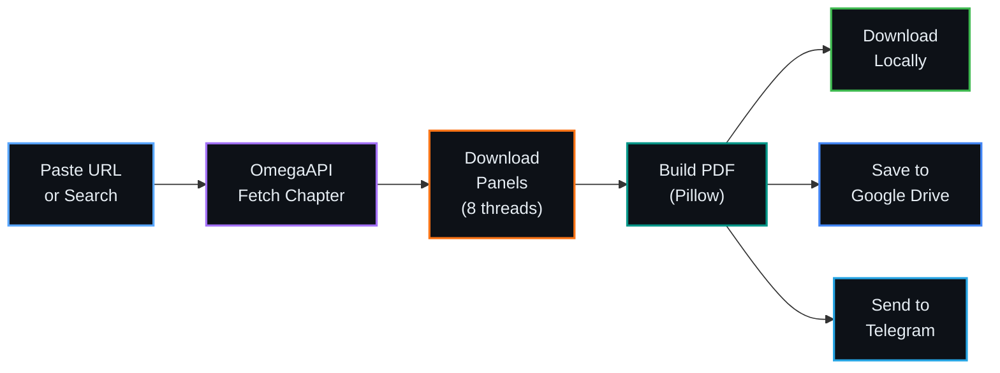
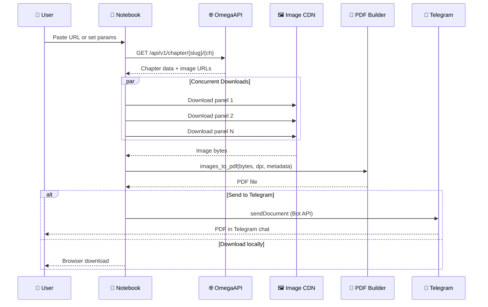
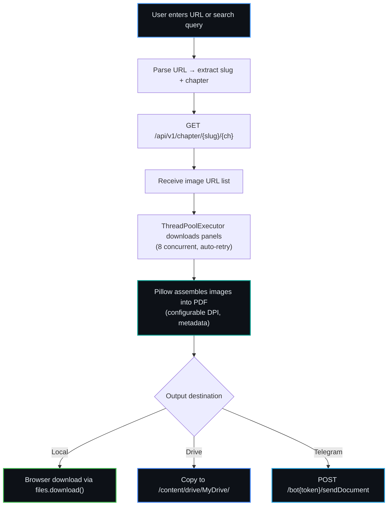

<div align="center">


<br/>

[](https://colab.research.google.com/github/Shineii86/OmegaPDF/blob/main/OmegaPDF.ipynb)
[](https://omegaapi.vercel.app)

<br/>

[](https://github.com/Shineii86/OmegaPDF/stargazers)
[](https://github.com/Shineii86/OmegaPDF/network/members)
[](https://github.com/Shineii86/OmegaPDF/issues)
[](https://github.com/Shineii86/OmegaPDF/pulls)
[](https://github.com/Shineii86/OmegaPDF/commits/main)
[](https://github.com/Shineii86/OmegaPDF)

<br/>

[](https://core.telegram.org/bots/api)
[](https://www.python.org/)
[](https://python-pillow.org/)
[](#-license)

<br/>

**Download manhwa panels from OmegaScans and generate PDFs — or send them straight to Telegram.**

Paste a URL. Get a PDF. That's it.

</div>

---

## Table of Contents

<details open>
<summary><b>Quick Navigation</b></summary>

<br/>

| Section | Description |
|:--------|:------------|
| [Overview](#-overview) | What is OmegaPDF? |
| [Features](#-features) | Full feature breakdown |
| [Project Structure](#-project-structure) | Repository layout |
| [Architecture](#-architecture) | Pipeline flow diagram |
| [Quick Start](#-quick-start) | Get running in 2 steps |
| [Telegram Setup](#-telegram-bot-setup) | Bot configuration guide |
| [Notebook Cells](#-notebook-cells) | Cell-by-cell breakdown |
| [Quality Presets](#-quality-presets) | DPI and file size guide |
| [Python Modules](#-python-modules) | Standalone code reference |
| [API Reference](#-api-reference) | OmegaAPI endpoints |
| [How It Works](#-how-it-works) | Step-by-step sequence |
| [FAQ](#-faq) | Common questions |
| [Troubleshooting](#-troubleshooting) | Fix common issues |
| [Contributing](#-contributing) | How to contribute |
| [Acknowledgements](#-acknowledgements) | Credits |
| [License](#-license) | Legal info |
| [Star History](#-star-history) | Community growth |

</details>

---

## Overview

OmegaPDF is a **Google Colab notebook** that fetches manhwa panels from [OmegaScans](https://omegascans.org) via the [OmegaAPI](https://omegaapi.vercel.app) and assembles them into clean PDF files. Upload directly to Telegram via Bot API — no local download required.

> [!NOTE]
> **No install. No GPU. No setup.** Open the notebook in Google Colab, run the setup cell, and you're ready. Works on any device with a browser.

> [!TIP]
> **Telegram Integration**: Skip the download step entirely. Send PDFs directly to your Telegram chat with one checkbox. Perfect for reading on mobile.

### What's Included

| Component | File | Purpose |
|-----------|------|---------|
| **Notebook** | `OmegaPDF.ipynb` | 10-cell Colab notebook — the main entry point |
| **Config** | `config.py` | API endpoints, quality presets, HTTP settings |
| **Fetcher** | `fetcher.py` | OmegaAPI client with concurrent downloads + retry |
| **PDF Builder** | `pdf_builder.py` | Image-to-PDF assembly with metadata |
| **Main** | `main.py` | Orchestrator tying fetcher + builder together |
| **Telegram** | `telegram.py` | Bot API integration for direct uploads |
| **Changelog** | `CHANGELOG.md` | Version history (newest first) |

---

## Features

<table>
<tr>
<td width="50%" valign="top">

### Core

| Feature | Details |
|---------|---------|
| **URL Paste** | Paste `omegascans.org/series/.../chapter-N` directly |
| **Search** | Find series by title |
| **Browse** | Trending & popular series listing |
| **Chapter List** | View all chapters for any series |
| **Page Range** | Download only pages 5-15 if you want |
| **Thumbnail Preview** | See first page before committing |

</td>
<td width="50%" valign="top">

### Output

| Feature | Details |
|---------|---------|
| **Quality Presets** | Low (72), Medium (150), High (300 DPI) |
| **PDF Metadata** | Title, author, subject embedded in PDF |
| **Merge Chapters** | Combine chapters 1-10 into one PDF |
| **Batch Download** | Separate PDFs for each chapter |
| **ZIP Packaging** | Bundle batch PDFs into a single zip |
| **Google Drive** | Save directly to Drive |

</td>
</tr>
<tr>
<td width="50%" valign="top">

### Speed & Reliability

| Feature | Details |
|---------|---------|
| **Concurrent Downloads** | 8 threads via `ThreadPoolExecutor` |
| **Auto-Retry** | Exponential backoff on failures |
| **Progress Bars** | `tqdm` visual progress for all downloads |
| **Error Handling** | Graceful skip on failed chapters |

</td>
<td width="50%" valign="top">

### Telegram

| Feature | Details |
|---------|---------|
| **Bot Integration** | Send PDFs directly to Telegram |
| **Test Connection** | Verify bot setup before downloading |
| **Batch Send** | Send multiple chapters with rate limiting |
| **Local Upload** | Send any existing PDF to Telegram |

</td>
</tr>
</table>

---

## Project Structure

```
OmegaPDF/
├── CHANGELOG.md              # Version history (newest first)
├── README.md                 # This file
├── requirements.txt          # Python dependencies
│
├── OmegaPDF.ipynb            # Main Colab notebook (10 cells)
│
├── config.py                 # API endpoints, quality presets, HTTP settings
├── fetcher.py                # OmegaAPI client + concurrent image downloader
├── pdf_builder.py            # Pillow-based PDF assembly with metadata
├── main.py                   # Orchestrator: fetch → download → build PDF
└── telegram.py               # Telegram Bot API integration
```

---

## Architecture

### Pipeline Flow



### Detailed Sequence



---

## Quick Start

<div align="center">

[](https://colab.research.google.com/github/Shineii86/OmegaPDF/blob/main/OmegaPDF.ipynb)

</div>

| Step | Action | What Happens |
|:----:|--------|-------------|
| 1 | **Open notebook in Colab** | Click the badge above |
| 2 | **Run Setup cell** | Installs deps, loads imports |
| 3 | **Paste a URL** | e.g. `https://omegascans.org/series/manitto/chapter-82` |
| 4 | **Run the cell** | Downloads panels, builds PDF, auto-downloads |

That's it. 4 clicks from zero to PDF.

### Local Usage

```bash
git clone https://github.com/Shineii86/OmegaPDF.git
cd OmegaPDF
pip install -r requirements.txt
```

```python
from main import build_chapter_pdf, build_merged_pdf

# Single chapter
build_chapter_pdf("solo-leveling", "chapter-1")

# Merge chapters 1-5 into one PDF
build_merged_pdf("solo-leveling", ["chapter-1", "chapter-2", "chapter-3"])

# With quality preset and page range
build_chapter_pdf("solo-leveling", "chapter-1", quality="high", page_range=(5, 15))
```

---

## Telegram Bot Setup

Send PDFs directly to Telegram without downloading to your device first.

### Step 1: Create a Bot

1. Open [@BotFather](https://t.me/BotFather) in Telegram
2. Send `/newbot`
3. Choose a name and username for your bot
4. Copy the **bot token** (format: `123456789:ABCdefGHIjklMNOpqrsTUVwxyz`)

### Step 2: Get Your Chat ID

1. Open [@userinfobot](https://t.me/userinfobot) in Telegram
2. Send any message
3. Copy your **chat ID** (format: `987654321`)

### Step 3: Start Your Bot

1. Open your bot's chat (search for its username)
2. Send `/start` — **this is required** so the bot can message you

### Step 4: Configure in Notebook

1. Fill in `TG_BOT_TOKEN` and `TG_CHAT_ID` in the Setup cell
2. Run the **Test Telegram** cell to verify

> [!IMPORTANT]
> You **must** start a chat with your bot (send `/start`) before it can send you files. The Telegram API will return a `chat not found` error otherwise.

---

## Notebook Cells

| Cell | Title | Purpose |
|:----:|-------|---------|
| 1 | **Setup** | Install deps, configure Telegram, define all functions |
| 2 | **Test Telegram** | Verify bot token + chat ID work |
| 3 | **Download from URL** | Paste an OmegaScans URL, get PDF |
| 4 | **Search Series** | Find series by title |
| 5 | **Browse Trending** | Popular series with ratings & views |
| 6 | **List Chapters** | View all chapters for a series |
| 7 | **Download by Slug** | Manual slug + chapter entry |
| 8 | **Merge Chapters** | Combine multiple chapters into one PDF |
| 9 | **Batch Download** | Download a range of chapters as separate PDFs |
| 10 | **Send Local PDF** | Upload any existing file to Telegram |

### URL Format

The notebook parses URLs in this format:

```
https://omegascans.org/series/{slug}/chapter-{number}
```

Examples:
- `https://omegascans.org/series/solo-leveling/chapter-1`
- `https://omegascans.org/series/manitto/chapter-82`
- `https://omegascans.org/series/sex-stopwatch/chapter-155`

---

## Quality Presets

| Preset | DPI | File Size (30 pages) | Best For |
|--------|:---:|:--------------------:|----------|
| **Low** | 72 | ~5 MB | Quick reading, slow connections |
| **Medium** | 150 | ~15 MB | Balanced — good for most use cases |
| **High** | 300 | ~40 MB | Print quality, zooming in on details |

> [!TIP]
> **Telegram limit**: 50 MB per file. Use Low or Medium quality for chapters with 50+ pages if sending to Telegram.

---

## Python Modules

### `config.py`
```python
from config import BASE_URL, QUALITY_PRESETS, MAX_WORKERS

print(QUALITY_PRESETS["high"])  # (300, "High (300 DPI — print quality)")
print(MAX_WORKERS)              # 8
```

### `fetcher.py`
```python
from fetcher import get_series, get_chapter_images, download_images_concurrent

# Get series info
series = get_series("solo-leveling")

# Get chapter image URLs
chapter = get_chapter_images("solo-leveling", "chapter-1")
image_urls = chapter["data"]["images"]

# Download all images in parallel with auto-retry
image_bytes = download_images_concurrent(image_urls)
```

### `pdf_builder.py`
```python
from pdf_builder import images_to_pdf, merge_chapter_images

# Build PDF from image bytes
images_to_pdf(
    image_bytes_list,
    "output.pdf",
    title="Solo Leveling — Chapter 1",
    author="OmegaPDF",
    dpi=150,
)

# Merge multiple chapters
all_bytes = merge_chapter_images([ch1_bytes, ch2_bytes, ch3_bytes])
images_to_pdf(all_bytes, "merged.pdf", title="Solo Leveling — Ch 1-3")
```

### `main.py`
```python
from main import build_chapter_pdf, build_merged_pdf

# Single chapter with all options
build_chapter_pdf(
    slug="solo-leveling",
    chapter="chapter-1",
    quality="high",
    page_range=(1, 10),
    output_name="SL_Ch1",
)

# Merge range of chapters
build_merged_pdf(
    slug="solo-leveling",
    chapters=["chapter-1", "chapter-2", "chapter-3"],
    quality="medium",
)
```

### `telegram.py`
```python
from telegram import test_connection, send_document, send_bytes

# Test bot setup
test_connection("BOT_TOKEN", "CHAT_ID")

# Send a PDF file
send_document("BOT_TOKEN", "CHAT_ID", "chapter.pdf", caption="Solo Leveling Ch.1")

# Send raw bytes
send_bytes("BOT_TOKEN", "CHAT_ID", pdf_bytes, "chapter.pdf")
```

---

## API Reference

OmegaPDF uses the [OmegaAPI](https://github.com/Shineii86/OmegaAPI) — a free, public, CORS-enabled API for OmegaScans content.

| Endpoint | Method | Description |
|----------|:------:|-------------|
| `/api/v1/series` | GET | Browse all series (pagination + search) |
| `/api/v1/series/{slug}` | GET | Series details with embedded chapters |
| `/api/v1/chapters/{slug}` | GET | Chapter list for a series |
| `/api/v1/chapter/{slug}/{chapter}` | GET | Chapter images (panel URLs) |
| `/api/v1/search?q={query}` | GET | Search series by title |
| `/api/v1/genres` | GET | List available genres |
| `/api/v1/health` | GET | Health check |
| `/api/v1/stats` | GET | API statistics |

### Response Format

```json
{
  "success": true,
  "data": {
    "id": 1125,
    "name": "Chapter 1",
    "images": [
      "https://media.omegascans.org/.../01.jpg",
      "https://media.omegascans.org/.../02.jpg"
    ],
    "pageCount": 11,
    "series": {
      "title": "Solo Leveling",
      "slug": "solo-leveling"
    }
  }
}
```

> **No authentication required.** CORS enabled. Cached with 5-15 min TTL.

---

## How It Works



---

## FAQ

<details>
<summary><b>Do I need to install anything?</b></summary>

No. The notebook installs everything automatically via `pip`. Just open in Colab and run.
</details>

<details>
<summary><b>How do I get the Telegram bot token?</b></summary>

Message [@BotFather](https://t.me/BotFather) on Telegram, send `/newbot`, follow the prompts, and copy the token. See [Telegram Setup](#-telegram-bot-setup) for details.
</details>

<details>
<summary><b>Why does Telegram say "chat not found"?</b></summary>

You need to **start a chat with your bot first**. Open your bot's username in Telegram and send `/start`. The bot can't message you until you've initiated the conversation.
</details>

<details>
<summary><b>Can I download chapters that require payment?</b></summary>

No. OmegaPDF only fetches free chapters. The API returns `isFree: true/false` for each chapter.
</details>

<details>
<summary><b>What's the Telegram file size limit?</b></summary>

50 MB per file when using the Bot API. For large chapters (50+ pages at High DPI), the PDF may exceed this. Use Low or Medium quality, or download locally.
</details>

<details>
<summary><b>Can I use this outside Google Colab?</b></summary>

Yes. Clone the repo, install `requirements.txt`, and use the Python modules directly. See [Local Usage](#local-usage).
</details>

---

## Troubleshooting

| Problem | Cause | Solution |
|---------|-------|----------|
| `Chapter not found` | Wrong slug or chapter format | Check the chapter list cell first |
| `No images found` | API returned empty images array | Chapter may be unavailable or behind a paywall |
| `Telegram: chat not found` | Bot hasn't been started | Send `/start` to your bot first |
| `Telegram: file too large` | PDF exceeds 50 MB limit | Use Low/Medium quality or fewer pages |
| `Telegram: unauthorized` | Invalid bot token | Regenerate token via @BotFather |
| `Connection timeout` | Slow network or CDN issue | Re-run the cell — auto-retry handles most cases |
| `ImportError: requests` | Dependencies not installed | Run the Setup cell first |
| `Invalid URL format` | URL doesn't match expected pattern | Use: `omegascans.org/series/{slug}/chapter-{num}` |

---

## Contributing

Contributions are welcome! Here's how you can help:

<table>
<tr>
<td width="33%" align="center">

### Report Bugs
Found something broken?

[Open an Issue](https://github.com/Shineii86/OmegaPDF/issues)

</td>
<td width="33%" align="center">

### Suggest Features
Have an idea?

[Start a Discussion](https://github.com/Shineii86/OmegaPDF/issues)

</td>
<td width="33%" align="center">

### Submit PRs
Ready to code?

[Fork & Submit](https://github.com/Shineii86/OmegaPDF/fork)

</td>
</tr>
</table>

### Development Setup

```bash
git clone https://github.com/Shineii86/OmegaPDF.git
cd OmegaPDF
pip install -r requirements.txt

# Test the modules
python -c "from config import BASE_URL; print(BASE_URL)"
python -c "from fetcher import list_series; print(list_series())"
```

---

## Acknowledgements

<table>
<tr>
<td width="50%" valign="top">

### API
- [OmegaAPI](https://github.com/Shineii86/OmegaAPI) — Free public API for OmegaScans
- [OmegaScans](https://omegascans.org) — Manhwa source

</td>
<td width="50%" valign="top">

### Libraries
- [Requests](https://requests.readthedocs.io) — HTTP client
- [Pillow](https://python-pillow.org) — Image processing & PDF generation
- [tqdm](https://tqdm.github.io) — Progress bars
- [python-telegram-bot](https://core.telegram.org/bots/api) — Bot API protocol

</td>
</tr>
</table>

---

## License

<div align="center">

This project is for **educational purposes only**.

All manhwa content belongs to their respective owners and OmegaScans.

Do not use this tool to redistribute copyrighted material.

</div>

---

## Star History

<div align="center">

[](https://star-history.com/#Shineii86/OmegaPDF&Date)

</div>

---

## Loved This Project?

<div align="center">

**Follow me on GitHub:** [Shineii86](https://github.com/Shineii86)

**Give a star:** [OmegaPDF](https://github.com/Shineii86/OmegaPDF)

[](https://telegram.me/Shineii86 "Contact on Telegram")
[](https://instagram.com/ikx7.a "Follow on Instagram")
[](mailto:ikx7a@hotmail.com "Send an Email")

<sup><b>Copyright &copy; <a href="https://telegram.me/Shineii86">Shinei Nouzen</a> All Rights Reserved</b></sup>

</div>
